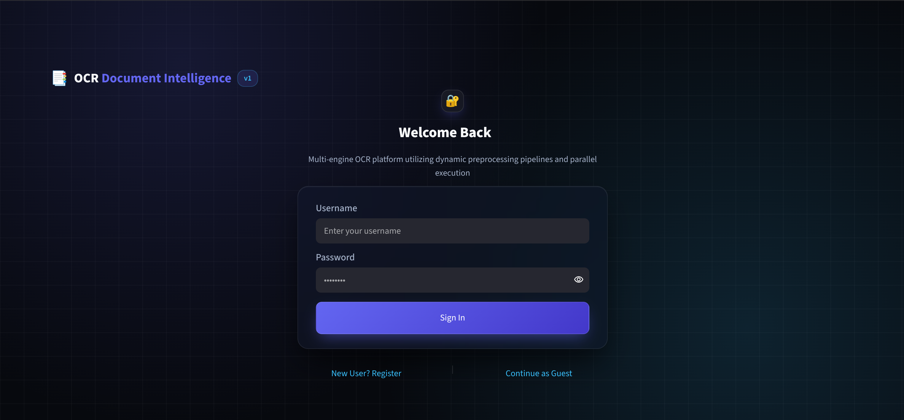
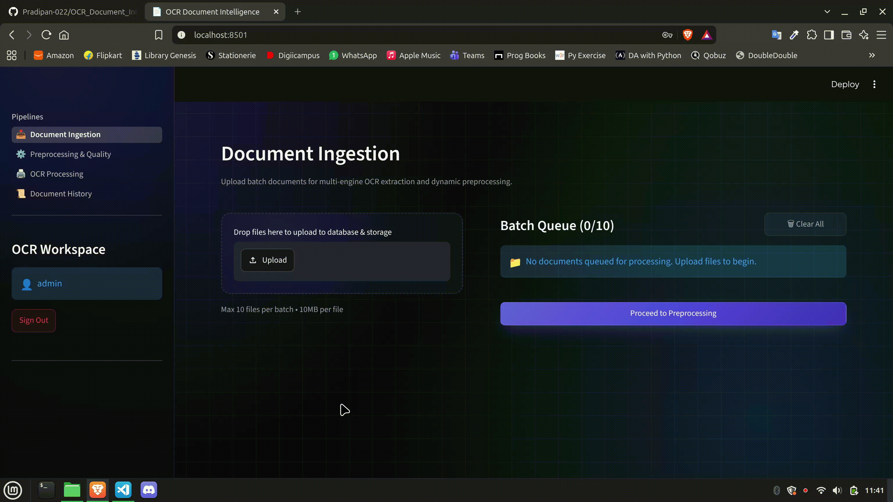
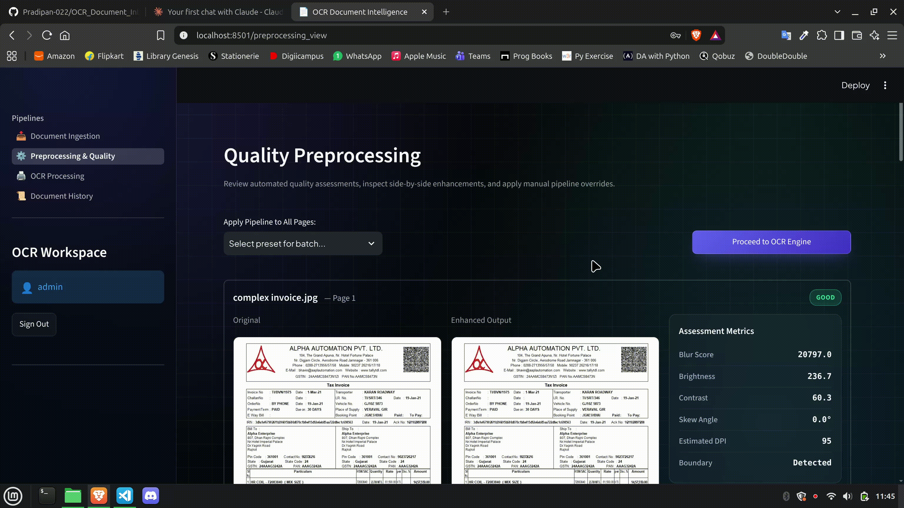
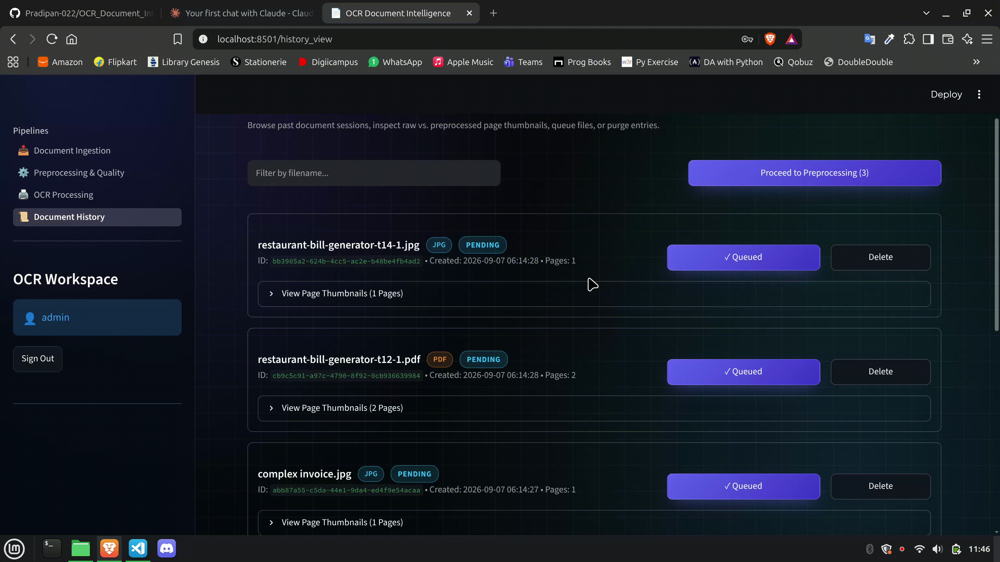
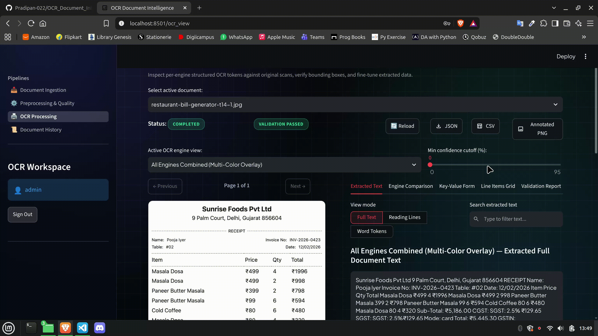

# OCR Document Intelligence Platform

[]()
[]()
[]()
[]()

A decoupled, enterprise-ready web application for intelligent document processing, quality profiling, and structured data extraction. Designed to handle complex documents like invoices and receipts, the platform features an automated quality assessment module, an adaptive OpenCV image enhancement pipeline, and multi-engine OCR orchestration across **PaddleOCR**, **Tesseract**, and **EasyOCR**.

---

## Table of Contents

- [Platform Workflows](#platform-workflows)
- [Screenshots & Demo](#screenshots--demo)
- [Technical Architecture & Core Features](#technical-architecture--core-features)
- [Tech Stack](#tech-stack)
- [Project Directory Structure](#project-directory-structure)
- [Prerequisites](#prerequisites)
- [Installation & Setup](#installation--setup)
- [Running the Application](#running-the-application)
- [Core API Endpoints](#core-api-endpoints)
- [Contributing](#contributing)
- [License](#license)

---

## Platform Workflows

The Streamlit frontend is organized around four core workflows to support a complete human-in-the-loop (HITL) data extraction lifecycle:

1. **Ingestion** — Upload, validate, and stage multi-format documents for processing.
2. **Preprocessing** — Automatically assess image quality and apply targeted enhancement pipelines.
3. **History** — Review historical changes, track document statuses, and access audit logs.
4. **OCR Results** — View consensus-based extraction, validate business rules, and export structured data.

---

## Screenshots & Demo

> **Note:** Replace the placeholders below with actual project assets located in the `docs/media/` directory.

### Authentication

<p align="center">
  
</p>

### Feature Walkthroughs

| Document Ingestion | Quality Preprocessing |
|:---:|:---:|
|  |  |
| *Batch document upload and tenant-scoped storage* | *Quality assessment and enhancement pipeline selection* |

| History Vault | OCR Results & Review |
|:---:|:---:|
|  |  |
| *Historical change audit log and document tracking* | *Multi-engine extraction, scoring, and data correction* |

---

## Technical Architecture & Core Features

### 1. Document Ingestion & Tenant Storage
* **Batch Processing:** Supports batch uploads of up to 10 files simultaneously (JPG, JPEG, PNG, PDF), capped at 10MB per file.
* **Tenant Isolation:** Uploaded files and rendered pages are securely isolated on disk within tenant-scoped directory structures (`storage/uploads/{username}/`).
* **Format Normalization:** Automatically converts multi-page PDFs into high-resolution, discrete page images during ingestion to ensure uniform OCR processing.

### 2. Quality Profiling & Preprocessing Pipelines
Documents undergo automated quality assessment to evaluate blur (Laplacian variance), brightness, contrast, skew angle, and resolution. The system routes pages to one of seven targeted enhancement pipelines (which can be manually overridden via the frontend):

| Pipeline | Applied Transformations |
|---|---|
| **Original** | Raw image pass-through (no modifications). |
| **Basic** | Standard grayscale conversion and bilateral denoising. |
| **Low Light** | CLAHE histogram equalization and adaptive thresholding for underexposed text. |
| **Overexposed** | Gamma correction and highlight attenuation for bright/glare images. |
| **Skewed** | Automated text contour angle detection and perspective deskewing. |
| **Noisy Scan** | Median filtering and morphological operations to clear scanning artifacts. |
| **Small Text** | Bicubic upscaling (2x) and unsharp masking for low-resolution prints. |

### 3. Multi-Engine OCR & Extraction
* **Parallel Execution:** Orchestrates concurrent text extraction across Tesseract, EasyOCR, and PaddleOCR engines to minimize processing latency.
* **Consensus & Scoring:** Calculates normalized scores based on engine confidence, text completeness, cross-engine Jaccard agreement, and execution speed to select the most accurate output.
* **Structured Data:** Extracts structured metadata (e.g., vendor info, invoice numbers, dates) and groups spatial bounding-box tokens into rows and columns to reconstruct line-item tables.

### 4. Validation, Review, & Database
* **Business Rules:** Enforces mathematical validation (e.g., Subtotal + Tax = Grand Total) and flags anomalies for human review.
* **Human-in-the-Loop Review:** The frontend provides side-by-side original/enhanced page rendering, editable field input forms, and historical change audit logging.
* **Database Scalability:** Implemented via SQLAlchemy 2.0 ORM. Defaults to SQLite for immediate development, but scales natively to PostgreSQL by modifying a single database connection string.
* **Security:** Employs standard, secure `bcrypt` password hashing for user accounts.

---

## Tech Stack

| Component | Technology |
|---|---|
| **Backend Framework** | Python, FastAPI |
| **Frontend UI** | Streamlit (Decoupled Client) |
| **Database & ORM** | SQLite / PostgreSQL, SQLAlchemy 2.0 |
| **Data Validation** | Pydantic v2 |
| **OCR Engines** | Tesseract, EasyOCR, PaddleOCR |
| **Image / PDF Processing** | OpenCV (`cv2`), Pillow (`PIL`), PyMuPDF, `pdf2image` |
| **Security** | Passlib (`bcrypt`) |
| **Package Manager** | `uv` |

---

## Project Directory Structure

```text
├── app/
│   ├── api/
│   │   └── v1/
│   │       ├── api.py                    # Main router aggregator
│   │       └── endpoints/
│   │           ├── auth.py
│   │           ├── document_routes.py
│   │           ├── history_routes.py
│   │           ├── ocr_routes.py
│   │           └── preprocess_routes.py
│   ├── core/
│   │   ├── config.py                     # Environment and application configurations
│   │   ├── database.py                   # SQLAlchemy engine initialization
│   │   └── security.py                   # Bcrypt hashing utilities
│   ├── models/                           # SQLAlchemy 2.0 ORM Models
│   │   ├── document_model.py
│   │   ├── ocr_model.py
│   │   └── user_model.py
│   ├── schemas/                          # Pydantic v2 Validation Schemas
│   │   ├── document_schema.py
│   │   ├── history_schema.py
│   │   ├── ocr_schema.py
│   │   ├── quality_schema.py
│   │   └── user_schema.py
│   ├── services/                         # Core Business Logic
│   │   ├── export_services.py
│   │   ├── extraction/                   # Table extraction & parsing heuristics
│   │   ├── ocr/                          # Engine wrappers (Paddle, Tesseract, EasyOCR)
│   │   ├── preprocessing/                # OpenCV pipelines & quality assessment
│   │   ├── validation/                   # Business rule enforcement
│   │   ├── orchestrator.py               # Pipeline state machine
│   │   └── storage.py                    # Disk/tenant storage manager
│   └── main.py                           # FastAPI entry point
├── frontend/
│   ├── app.py                            # Streamlit entry point
│   ├── config.py
│   ├── utils/
│   │   ├── api.py                        # Backend communication handlers
│   │   └── state.py                      # Streamlit session state management
│   └── views/                            # Decoupled UI components
│       ├── auth_view.py
│       ├── history_view.py
│       ├── ingestion_view.py
│       ├── ocr_view.py
│       ├── preprocessing_view.py
│       └── sidebar_view.py
├── storage/
│   └── uploads/                          # Local file storage (ignored in version control)
├── pyproject.toml
├── uv.lock                               # Deterministic dependency definitions
└── README.md
